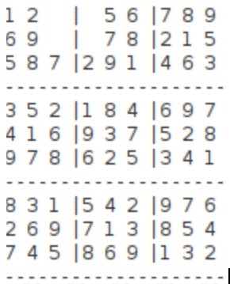

# Sudoku Solver - MIPS32

Petit projet en assembleur MIPS32 : un résolveur de Sudoku.   
Le programme prend en entrée un fichier texte (input.txt) contenant la grille du Sudoku à résoudre, et affiche toutes les solutions dans la console selon cet affichage :

## Fonctionnement

Le fichier input.txt doit contenir la grille sous forme de 9 lignes de 9 chiffres.

Les cases vides sont représentées par 0.

Le programme lit le fichier, résout le Sudoku, puis affiche la solution dans la console.

## Utilisation

- Compiler le code assembleur avec un simulateur MIPS (ex. MARS ou SPIM)

- Lancer le programme avec input.txt comme fichier d’entrée.

- Le résultat s’affiche directement dans la sortie standard.

Exemple de input.txt : `530070000600195000098000060800060003400803001700020006060000280000419005000080079`
